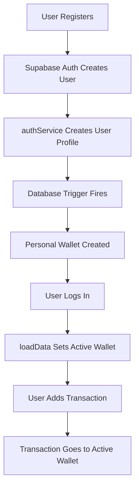

# ✅ Default Personal Wallet Setup

## What Was Implemented

I've set up automatic personal wallet creation for new users! Here's what happens now:

### 1. **Automatic Wallet Creation on Signup** 🎉

When a user registers:
1. User account is created in Supabase Auth
2. User profile is created in the `users` table
3. **A "Personal Wallet" 💰 is automatically created** via database trigger
4. This wallet becomes the active wallet

### 2. **Transactions Use Active Wallet by Default** 💳

When adding a transaction:
- If no `wallet_id` is specified, it automatically uses the **active wallet**
- The active wallet is set to the first wallet (Personal Wallet) by default
- Users can still specify a different wallet if needed

---

## Files Modified

### 1. Database Schema
**File:** `supabase_schema.sql`

Added a PostgreSQL function and trigger:
```sql
CREATE OR REPLACE FUNCTION create_default_wallet()
RETURNS TRIGGER AS $$
BEGIN
  INSERT INTO public.wallets (name, emoji, is_shared, owner_id)
  VALUES ('Personal Wallet', '💰', FALSE, NEW.id);
  RETURN NEW;
END;
$$ LANGUAGE plpgsql SECURITY DEFINER;

CREATE TRIGGER on_user_created
  AFTER INSERT ON public.users
  FOR EACH ROW EXECUTE FUNCTION create_default_wallet();
```

### 2. Store Updates
**Files:** `store.ts` and `supabaseStore.ts`

Updated `addTransaction` method to use active wallet by default:
```typescript
addTransaction: async (data) => {
  const user = get().user;
  const activeWallet = get().activeWallet;
  if (!user?.id) return;

  // Use active wallet if no wallet_id is provided
  const wallet_id = data.wallet_id || activeWallet?.id;
  if (!wallet_id) {
    console.error('No wallet available for transaction');
    return;
  }

  await db.createTransaction({
    ...data,
    wallet_id,
    user_id: user.id,
  });
  await get().loadData();
}
```

---

## How to Apply the Changes

### Step 1: Run the SQL Trigger

Run this SQL in your Supabase SQL Editor:

**File:** `add_default_wallet_trigger.sql`

```sql
-- Function to create a default personal wallet for new users
CREATE OR REPLACE FUNCTION create_default_wallet()
RETURNS TRIGGER AS $$
BEGIN
  -- Create a personal wallet for the new user
  INSERT INTO public.wallets (name, emoji, is_shared, owner_id)
  VALUES ('Personal Wallet', '💰', FALSE, NEW.id);
  
  RETURN NEW;
END;
$$ LANGUAGE plpgsql SECURITY DEFINER;

-- Trigger to create default wallet when a new user is created
CREATE TRIGGER on_user_created
  AFTER INSERT ON public.users
  FOR EACH ROW EXECUTE FUNCTION create_default_wallet();
```

### Step 2: Test It!

1. **Register a new user** in your app
2. **Check that a "Personal Wallet" was created automatically**
3. **Add a transaction** - it should go to the Personal Wallet by default
4. **Verify in Supabase Dashboard:**
   - Go to **Table Editor** → **wallets**
   - You should see the "Personal Wallet" for your new user

---

## Benefits

✅ **Better UX** - Users don't need to create a wallet manually
✅ **Immediate Use** - New users can start adding transactions right away
✅ **Consistent** - Every user starts with the same setup
✅ **Automatic** - Happens in the database, no app code needed

---

## How It Works



---

## Testing

### For New Users
1. Register a new account
2. You should immediately have a "Personal Wallet" 💰
3. Add a transaction without specifying a wallet
4. It should appear in your Personal Wallet

### For Existing Users
- Existing users keep their current wallets
- The trigger only affects new signups
- If they have no wallets, they can create one manually

---

## Next Steps

You can customize the default wallet:
- Change the name from "Personal Wallet" to anything you like
- Change the emoji from 💰 to any other emoji
- Just edit the SQL function in Supabase

**Ready to test?** Run the SQL trigger and try registering a new user! 🚀
